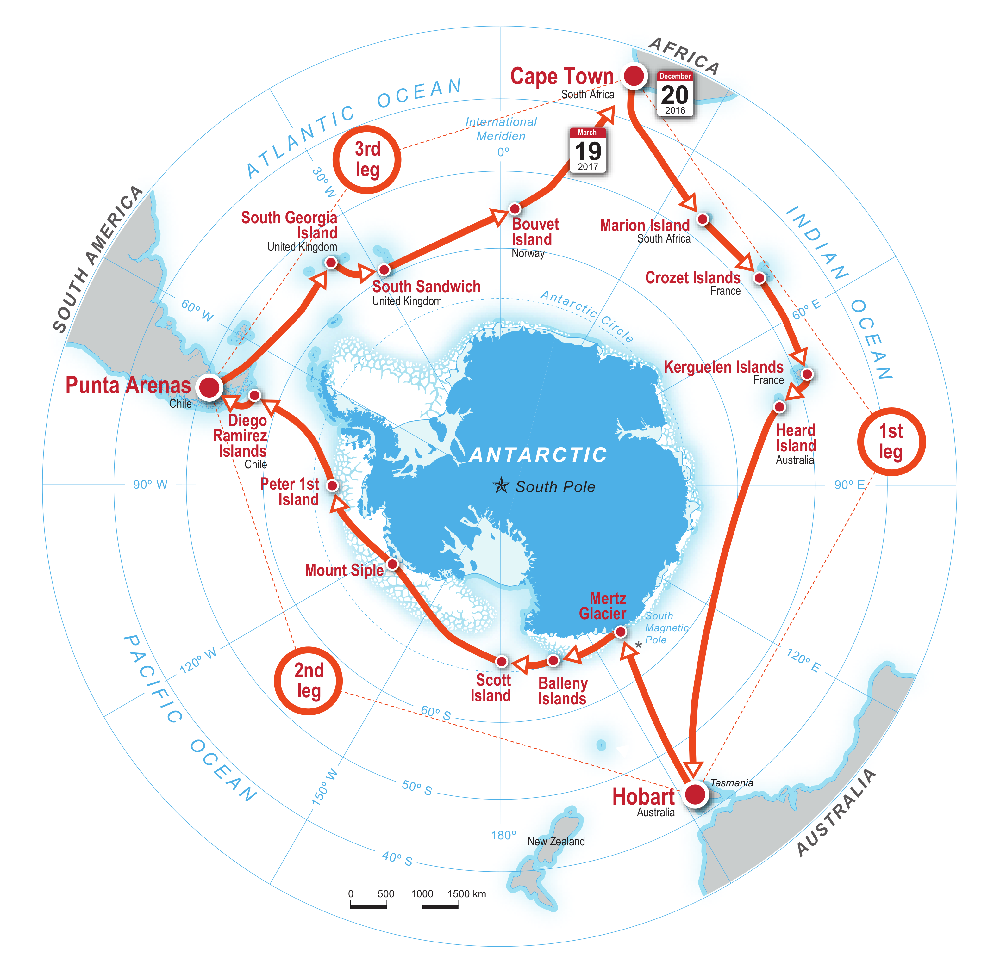

name: inverse
layout: true
class: center, middle, inverse
---
layout: false
template: inverse
class: title-slide
### Django during the Antarctic Circumnavigation Expedition (ACE)


.right[Django London Meetup, Zoom, 2020. Carles Pina i Estany (carles@pina.cat)]
---
layout: false
# Some ~~Django~~ admin
--

- You might hear firecrackers during the presentation

--
- I'm now in Catalonia (Spain)

--
- This evening we have celebrations for St. John's which is tomorrow

--

St John's evening tradition is...
---
background-image: url(images/st-john/bonfire.jpg)
background-size: contain
.footnote[.white[Copyright: Lee Haywood, CC-BY-2.0]]
---
background-image: url(images/st-john/fireworks.jpg)
background-size: contain
.footnote[.white[bayasaa, CC-BY-2.0]]
---
# St John's evening tradition is...
- the celebration (but 2 nights late!) of the summer solstice
--

- to scare witches away
--

- celebrated in different parts of Spain and different countries

--

This is one of many Catalan traditions...
---
background-image: url(images/st-john/castell.jpg)
background-size: contain
.footnote[Minyo malva, CC-BY-SA-3.0]
---
background-image: url(images/st-john/calcots.jpg)
background-size: contain
---
layout: false
# What I'm going to talk about tonight
<center>
<table>
<tr>
    <td valign="top">
        <ul>
	    <li>Using Django for data management</li>
	    <li>On board a science expedition around Antarctica</li>
	    <li>Why Django?</li>
	    <li>How it was used</li>
	 </ul>
    </td>
    <td>

.right[.small[Copyright: Swiss Polar Institute]]
</td>
</tr>
</table>
</center>
---
background-image: url(images/akademik_tryoshnikov_grytviken.jpg)
background-size: contain

## R/V Akademik Tryoshnikov

.footnote[Carles Pina i Estany, CC-BY-4.0]
---
background-image: url(images/ace_team.jpg)
background-size: contain

.footnote[Copyright: EPFL/Parafilms]
???
Lots of teams: 22. Many people
---
# Context 
- I was a C++/Qt software engineer
- I took a sabbatical for a year in 2016-2017
- Casual user of Python: scripts at work, evenings and weekends, London Python Code Dojos, etc.
- Used GNU/Linux for a long time
- Long time ago: system administrator / network administrator
---
background-image: url(images/for_fun/iceberg-light.jpg)
background-size: contain

# Data management + IT during the expedition


.footnote[Carles Pina i Estany, CC-BY-4.0]
---
# Our tasks: 
- managed the data of all 22 science projects
 - set up the data management recording system (Django);
 - set up the data storage and back-ups;
 - liaised with scientists to back up data, record metadata in a database and create metadata records;

- telecommunications setup:
 - onboard network;
 - e-mail system;
 - file uploader;

- connecting and problem solving with science equipment. 
---
# What is data management onboard?
- Backup all the data collected onboard
- Keep a log of what was happening: 
 - ultimate goal - to be able to describe where, when, by whom and for what reason the data were collected
- Keep a database of all samples collected
- Create metadata records of all data sets so they are well described
--


# Why?
- Backup to avoid losing data and to archive it properly for the future
- The data can be made publicly available after the 2 year embargo
- Make data easier to discover and usable by others in the future

---
# science-cruise-data-management
Data manager (Jen) said: Can you help me build a database?
--


I answered: yes! (and thought of MySQL and _create table_...)
--


Jen also meant a web system to enter data in the database!
---
background-image: url(images/for_fun/penguins_01.jpg)
background-size: contain

#.white[Django]

.footnote[Carles Pina i Estany, CC-BY-4.0]
---
I had used (to a certain extent):
- Python
- Flask
- MySQL
- SQLAlchemy
- Mustache
--


But... How would I create the forms to enter data into the database in an efficient way?
--


I asked a friend (thanks Fran!)... and he said...
--


# Django!
--

(I thought... nooooo... too big, no time to learn this now!)
--


Fran created a Django project with a small admin an example... and I loved it!
---
# My first week of Django
I went back home and really enjoyed learning Django:
- Writing Django models is easier than MySQL _create table_ (with foreign keys, etc.)
- I had done similar things years ago without any framework: using Django was more efficient!
- The effort involved in writing all the authentication, permissions, admin, migrations, integrating templates with models, etc. using separate tools would have been overwhelming

---
# If you are new to Django...
I feel that for debugging certain issues it helps to have an awareness of:
- Python
- HTML
- CSS
- git
- Javascript
- jQuery
- HTTP
- Deployments
- SQL
- Database administration
- Server administration
- ...

Luckily I was familiar (more or less) with many of these things
---
background-image: url(images/for_fun/clouds_02.jpg)
background-size: contain

# science-cruise-data-management
https://github.com/Swiss-Polar-Institute/science-cruise-data-management

.footnote[.white[Carles Pina i Estany, CC-BY-4.0]]
---
# The application before leaving port
- The Django *admin* served as a way for scientists to enter, search for and update data about what happened on board
- Based on similar cruise data management database structure used by BODC (British Oceanographic Data Centre) and BAS (British Antarctic Survey)
- Map of the ship's position and data collection locations
---
background-image: url(images/event_report.png)
background-size: contain 
---
# How the system grew during the expedition
- All focussed on "we need this soon" and "I only need to maintain this until April"

--
- Very rapid development. Initially focused on collecting data

--
- Aimed to make the data useful for the scientists as soon as possible: visualisations (maps and graphs), reports, validation

--
- Added small utilities that were asked for (e.g. lat long converters, ship time to position, etc.)

--
- 3 years later: the system is still running in the institute internally for the data manager
--

- For the past year I've been working on two Django applications. I would do it differently now but it was very useful!
---
background-image: url(images/intranet_homepage.png)
background-size: contain
---
background-image: url(images/intranet_location.png)
background-size: contain 
---
background-image: url(images/intranet_map.png)
background-size: contain 
---
# Working (almost) off-line
No easy access to Stackoverflow/Google for 4 months.

- Django documentation is also available off-line: it's fantastic
- Django source code: a way to complement the documentation
- It was very handy that I had lot of (unrelated) source code on my laptop
- Python console with the help method

--

I didn't use PDF books as much as I thought.

---
# In retrospect
Django was a very good tool for what we needed:
- Without Django we would have taken much longer to do the same 
- Django didn't get in the way (I had thought it would)
- Admin forms were possible to adapt and change
- Django _commands_ were very easy to implement and useful for accessing the models from command line parameters, widely used for many of our scripts
- Thanks Django developers for going an extra mile with helpful error messages. E.g.:
```bash
main.Project.title: (fields.E120) CharFields must define a 'max_length' attribute.
```
--
- Django documentation is very well written!
???
If Django didn't exist I would have had to implement it for the expedition, in a hacky way
---
# Final thought
From the Django website:
```bash
Django makes it easier to build
better Web apps more quickly and
with less code.
```
--


Data manager thinks:
```bash
We need to build a database
```
--

Django can be used for building database frontends.

???
Django for data managers and for other professions: cooks, biologists, etc.
---
background-image: url(images/for_fun/ice_01.jpg)
background-size: contain

# Thank you!

# Questions?

.footnote[Carles Pina i Estany, CC-BY-4.0]
---
class: inverse
## Contact
Carles Pina i Estany ([carles@pina.cat](carles@pina.cat), https://carles.pina.cat)
## License


This work is licensed under a [Creative Commons Attribution 4.0 International License](https://creativecommons.org/licenses/by-sa/4.0/).

## Links
ACE: https://spi-ace-expedition.ch

Swiss Polar Institute: https://swisspolar.ch

## Slides
Slides have been written using Markdown and rendered using remarkjs (https://remarkjs.com)

Slides: https://github.com/cpina/ace-it-presentation / https://cpina.github.io/ace-it-presentation/

