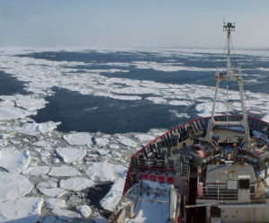
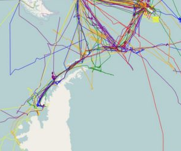
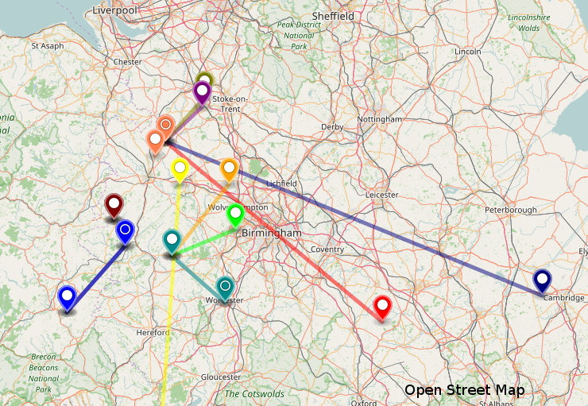
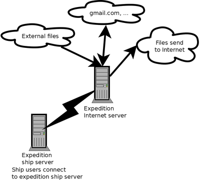
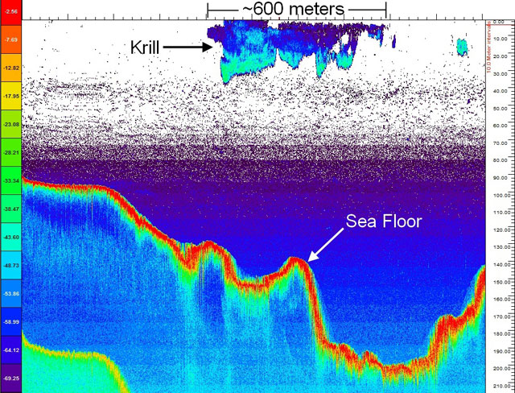

name: inverse
layout: true
class: center, middle, inverse
---
layout: false
template: inverse
class: title-slide
### Dando la vuelta a la Antártida con software libre 


.right[Universidad Nacional de Cañete, 2017. Carles Pina y Jen Thomas]
---
layout: false
# Contenido
- Quiénes somos
- ¿Qué es ACE?
- Gestión de datos
- Django en la expedición
- Sistema informático y telecomunicaciones
- Sistema de email
- Otros:
 - backups
 - GPS
 - Ferrybox
 - profundidad
 - CTD
 - paquetes
 - instalar LibreOffice sin el instalador
 - ...
???

Dar las gracias a Alex Pachecho, Ricardo Inquilla, Daniel Yucra y a la universidad por invitarnos.
---
template: inverse
# ¿Quiénes somos?
---
layout: false
# Carles Pina i Estany
- Nací en Manresa, cerca de Barcelona (España)
- Desde 2009 trabajo en Mendeley (departamento de Mendeley Desktop) trabajando en C++/Qt
- Normalmente vivo en Londres (Reino Unido) pero nos tomamos un año sabático para viajar
- Me gusta el software libre (uso Debian desde Debian Potato en el 2000)
- Algunos proyectos que hago/ayudo...
---


(en Debian/Ubuntu)
---


(lo usamos mucho en la Antártida)
--


(xnetload no está mantenido, después del viaje hice qnetload)
https://github.com/cpina/qnetload
---
background-image: url(images/benches1.png)
background-size: contain
---
background-image: url(images/benches2.png)
background-size: contain
---
background-image: url(images/chronojump.png)
background-size: contain
---
background-image: url(images/grub2.png)
background-size: contain
---
background-image: url(images/olfactory_notifications.jpg)
background-size: contain
---
## Otras cosas
(pequeñas, viejas o no mantenidas)

- Catux-USB (2004)
- Django (después de la expedición)
- Pidgin (notificaciones)
- geeqie (copiar path)
- Pydance (soporte multilingue)
- Amarok
- gnokii
- ...
---
# Jen Thomas
???
- Nací en un pueblo en Inglaterra
- Trabajaba 3.5 años como "Data Manager" del Instituto Británico de la Antartida (British Antarctic Survey, Cambridge, Reino Unido) 
- Ya había hecho dos expediciones en un barco a la sub-Antártida 
- Ahora trabajo para el Instituto Polar de Suiza (Swiss Polar Institute, Lausanne, Switzerland)
- Hobbies: pájaros, insectos, el medio ambiente, ciencia, viajar, música
---
class: middle, center
 

 

Images: Polar Data Centre, British Antarctic Survey
---
background-image: url(images/rrs_james_clark_ross.jpg)
background-size: contain
.footnote[Copyright Adam Bradley]
---
Mapas de dispersión de aves usando Leaflet y Open Street Map


---
class: middle, center
template: inverse
# Introducción
---
class: middle, center
# ¿Qué es ACE?
---
background-image: url(images/ace_final_map_official.png)
background-size: contain
.footnote[Copyright: Swiss Polar Institute]
???
- Inicios de noviembre 2017: David Walton contacta a Jen (en 6 semanas nos pusimos apunto: pruebas médicas, entender qué hacer, empezar una aplicación para los científicos)
- expedicion pagada por un filantropo suizo
- unica / especial porque estaba realizada en un verano solo, y combina una variedad de ciencia (del océano, de la atmósfera y también de las islas)
- 3 etapas
- Inicios de noviembre: David Walton contacta a Jen (en 6 semanas nos pusimos apunto: pruebas médicas, entender qué hacer, empezar una aplicación para los científicos)
- 20 de diciembre: inicio de parte 1 desde Cape Town (Sud África)
- 22 de enero: inicio de parte 2 desde Hobart (Austrália)
- 26 de febrero: inicio de parte 3 desde Punta Arenas (Chile)
- 22 de marzo: llegamos otra vez a Cape Town (Sud África)

Después volvimos a Europa en barco (llegamos el 12 de abril)
---
class: middle, center
# R/V Akademik Tryoshnikov
---
background-image: url(images/akademik_tryoshnikov_grytviken.jpg)
background-size: contain
???
- Rompe hielos ruso
- 133 metros de eslora
- 23 metros de manga
- Tripulación: 60 personas: cocineras, ingenieros, tecnicos, no había informatica,
- Alquilado para la expedición: casi todos los equipos llevaron su propio equipos. Sin informático abordo.
---
background-image: url(images/rocking.jpg)
background-size: contain
---
class: middle, center
# La ciencia
---
background-image: url(images/ace_team.jpg)
background-size: contain

.footnote[Copyright Swiss Polar Institute]
---
background-image: url(images/south_georgia_ciencia.jpg)
background-size: contain
---
background-image: url(images/waves.jpg)
background-size: contain
---
background-image: url(images/releasing_radiosonde.jpg)
background-size: contain
---
class: middle, center
template: inverse
# La gestión de datos
---
class: middle, center
## ¿Qué es y qué hicimos?
???
- Ayuda a los científicos de:
 - guardar los datos
 - colectar metadatos sobre la expedición
 - crear un log de muestras
---
class: middle, center
## ¿Por qué?
???
- escribir metadatos
 - como, por que, por quien, cuando, donde, problemas
- para hacer los datos más útiles y abiertos para el futuro
---
background-image: url(images/metadata_discovery.png)
background-size: contain
---
background-image: url(images/data_discovery.png)
background-size: contain
---
# Resumen de nuestro trabajo
- Guardar datos
- Una base de datos (actividades, metadatos, etc.)
- Interfaz de la base de datos 
- Intranet para acceder a los datos, ver información
- Mapa de la ruta
- Comunicaciones - email, internet
- Ayuda con dispositivos, portátiles, software....
- Aconsejar a los científicos en la gestión de datos
---
background-image: url(images/for_fun/penguins_02.jpg)
background-size: contain
---
# ¿Dónde guardar los datos?
- A principios de diciembre Jen preguntó a los 22 investigadores principales cuantos GB necesitarán para almacenar sus datos
- Estimamos en total unos 60 TB
--


### Preguntamos al barco qué almacenamiento tienen
--

- Nos dicen que 500 GB (0.5 TB)
---
# Datos, datos, datos...
- Preguntamos, miramos, comparamos y al final compramos:
 - 15 discos duros 8 TB Western Digital
 - 15 discos duros 8 TB Seagate
 - 2 NAS Synology DS-1815+
 - 2 Gigabit switches
 - 2 SAI APC
 - ...
--


¡todo esto llegó a Sudáfrica 2 días antes de salir!

???
Tuvimos que atar todo para que no se cayera todo
---
# Datos, datos, datos...
¡Lo pusimos a punto!


Incluyó bajarse 300 MB para los Synologys: corrí a una cafeteria y después al hotel para bajarme los ficheros necesarios.
---
# Material de repuesto
En un barco se necesitan piezas de recambio para casi todo.

Compramos material sobrante (discos, switches, etc.) ¡Durante un mes no teníamos acceso a ninguna tienda!
???
- Algunos equipos que están acustombrados en hacer estos viajes llevaban mas que 50 cajas de cosas por si acaso...
---
background-image: url(images/propeller_blade.jpg)
background-size: contain 

???
- Explicar como cambiar: dry dock o bien ¿playa cuando baja la marea?
- Tienen que estar equilibrados o sinó no va bien y hay demasiada vibración.
---
template: inverse
# La web intranet
---
# Django
- No sabíamos Django antes de empezar
- Tiene muy buena documentación off-line
- Yo tenía mucho código Python en mi ~/git (código mío, de proyectos libres). Sirve a veces más que libros, manuales, etc.
---
# ¿Por qué Django nos era muy cómodo?
- Escribiendo un modelo genera formularios y base de datos
- Cambiando el modelo hace las migraciones en la base de datos
- Sistema autenticación de usuarios
- Sistema de permisos de usuarios
- Sistema de plantillas integrado con los modelos
- Muy fácil de extender como programador
- La interfaz de usuario (parte admin) cómoda sin esfuerzo
---
# Modelos en Django
Ejemplo de model en Django:

```python
class StorageCrate(models.Model):
    name = models.CharField(max_length=255, unique=True)
    location = models.CharField(max_length=255)
    description = models.CharField(max_length=255, null=True, blank=True)
    comment = models.TextField(null=True, blank=True)
```
--
- Genera los formularios
- Genera la tabla en la base de datos si no existía
- Genera migraciones si el modelo existía y era diferente
---
# La base de datos
- Teníamos que crear una base de datos para que los científicos introdujeran información de sus actividades - sus metadatos
- Yo conocía Flask, Mysql, SQLAlchemy
- Pero ¿cómo hacer los formularios para entrar todos los datos? (a mano con Flask tardarí mucho, con C++/Qt aún peor!)
- Estaba una noche en casa un amigo en Londres y le pregunté como lo haría él
--

- Dijo: ¡con Django!
(yo pensaba que no quería Django, que era demasiado grande)
--

- Y hicimos un proyecto pequeño en Django de ejemplo para que viera como funciona
---
class: middle, center
# ¡Gracias Fran y Django!
---
# science-cruise-data-management
http://github.com/cpina/science-cruise-data-management

- Empecé a programar toda la semana... ¡la documentación de Django está muy bien! (y disponible offline)
- Visité a Fran para preguntarle más cosas
- Jen y yo hicimos toda la Intranet con Django
---
background-image: url(images/intranet_homepage.png)
background-size: contain
---
background-image: url(images/event_report.png)
background-size: contain 
---
background-image: url(images/intranet_location.png)
background-size: contain 
---
# Mapa
- Yo había usado la librería Leaflet (sobretodo para Benches)
--

- Queríamos hacer un mapa de la expedición:
 - ¿Dónde estábamos?
 - ¿Dónde han pasado los eventos?
--

- Pero la proyección del mapa no es la estándard
---
background-image: url(images/intranet_map.png)
background-size: contain 
---
# Proyección del mapa
- Leaflet tiene soporte para diferentes proyecciones (con un plugin)
- La Antártida normalmente se visualiza con proyección EPSG:3031 (el usado normalmente es Mercator)
- No hay tiles (imágenes PNG como las de openstreetmap.org) renderizadas con la proyección EPSG:3031
- En lugar de tiles usé shapefiles (*.shp): describen el contorno de la Antártida
- Pasé los shapefiles del formato original (shp) a geojson (para que Leaflet lo cargara)
--


```bash
ogr2ogr -f GeoJSON -simplify 1000 -t_srs EPSG:3031 \
Coastline_high_res_polygon.geojson Coastline_high_res_polygon.shp
```
---
# Resumen Django
- Sin Django hubieramos tardado muchísimo más
- Si es necesario Django permite fácilmente acceder a la base de datos directamente (y aún crear los objetos de los modelos)
- Los "commands" (parte de la aplicación de Django pero se usan desde la línea de comandos, no desde el navegador) son muy cómodos de escribir
- Estamos muy contentos con Django (aunque primero pensé que no sería tan útil)
---
background-image: url(images/for_fun/clouds_02.jpg)
background-size: contain
---
template: inverse
# Sistema informático expedición en el barco
---
# Servidores hardware
- Un portátil viejo: Ubuntu 16.10 (se calentaba, etc.). Fué cómodo porqué lo llevamos ya semi configurado de casa
- (segundo mes hasta el final): Añadimos un portátil nuevo con Ubuntu 16.10


???
Usamos muchas tarjetas de red tipo USB (para conectar los portátiles a la red de la expedición, tripulación, Internet, red del puente de mando...)
---
# Tareas de los servidores
- Sistema Django
- Sistema de email (ver más adelante)
- Subir/bajar ficheros internet (ver más adelante)
- DNS (Bind) (para http://ace-intranet.lan, http://ace-mail.lan)
- DHCP Server (ISC DHCP)
- Servidor git interno (no podíamos depender de nada de Internet)
- Importar datos GPS (ver más adelante)
- Copias de seguridad de diferentes ordenadores (ver más adelante)
- Copias de seguridad entre NAS1 y NAS2 (rsync)
- Muchas otras tareas pequeñas (p. ej. reiniciar un router a medianoche)

???
-OSX no resuelve dirección dominios si no tiene conexión a internet?
-Primero reiniciaba el router a mano desde la habitación pero entonces me olvidaba y tenía que levantarme o la gente por la mañana me esperaba...
---
template: inverse
# Internet en el barco
---
# Introducción
- Teníamos 2 sistemas Iridium
- Inicialmente un sistema para llamadas, otro para Internet
- Esto son, 128 kbits para _oficialmente_ 80 personas
--

- Las conexiones via Iridium son MUY inestables


L. Wood, SaVi: satellite constellation visualization, First Annual CCSR Research Symposium (CRS 2011), Centre for Communication Systems Research, 30 June 2011.
  http://arxiv.org/abs/1204.3265
---
# Iridium
- La constelación tiene 66 satélites operativos
--

- Nombre Iridium porqué originalmente había 77 satélites: el número atómico de Iridium 
--

- Tienen satélites sin usar: los activan y ponen en el plano cuando hay problemas
--

- Hay cobertura en el polo norte y sur! Pero MUY lento y inestable: se conecta y desconecta porqué no son geostacionarios y hay cambios de satélite
--

- Los satélites están a unos 780 Km de la tierra (GPS a unos 20.000 Km)
--

- Por la noche a veces se pueden ver (como estrellas fugaces)
--

- Estan lanzando satélites de nueva generación
--

- ¡Hay cobertura en el polo norte y sur! Pero MUY lento y inestable: se conecta y desconecta porqué no son geostacionarios y hay cambios de satélite
---
background-image: url(images/iridium1.jpg)
background-size: contain
---
background-image: url(images/iridium2.jpg)
background-size: contain
---
background-image: url(images/slow_ping.jpg)
background-size: contain
---
# Reproducir vídeo:
## iridium-apt-get-update.ogv
---
# VSAT
- No usamos VSAT durante la expedición
- Cuando lo pude probar (hemisferio norte, por el contrato que el barco tiene):  ¡unos 10 Mbps estables!
- La antena apunta siempre (con motores) al satélite geostacionario
- A unos 35.900 Km de la tierra (geoestacionario)
???
VSAT - Very Small Aperture Terminal (Terminal de Apertura muy Pequeña)
---
background-image: url(images/iridium3.jpg)
background-size: contain
---
# Necesidades de comunicaciones
- Los científicos necesitaban:
 - Bajar imagenes de satélite de hielo
 - Bajar modelos meteorológicos
- Los periodistas necesitaban:
 - Subir fotos
 - ¡Subir vídeos!
- Todos necesitaban/querían:
 - Comunicarse con sus equipos (resolver problemas)
 - Comunicarse con su família, amigos
---
background-image: url(images/sea_ice.jpg)
background-size: contain
---
template: inverse
# Internet parte 1
---
class: middle, center
# Internet parte 1
## Setup de las redes de comunicación
---
# Setup parte 1
- Un router TP-Link (gama de hogar, no profesional) conectado al Iridium
- Dos cables con ancho de banda "ilimitado"
- Sistema WiFi del router como red de invitados (guest network) limitando la velocidad (50% o 70% del total) y menos prioridad

???
La priorización sólo no funcionaba bien porqué la conexión es inestable
---
class: middle, center
# Internet parte 1
## Medios de comunicación
---
# Email
- Recomandamos usar Thunderbird en cada portátil y usar la conexión cable
- Fué bastante mal:
 - Windows tiene time-outs cortos (e.g. para DNS)
 - Thunderbird tiene problemas con conexiones inestables (y mala información para el usuario)
 - Tuvimos que configurar muchos Thunderbirds para diferentes proveedores (universidades, empresas, etc.)
 - Nunca sabíamos si había un error de configuración (servidores IMAP, SSL, usuario/contraseña) o bien de conexión
 - Configuramos Thunderbird para bajar sólo emails recientes, sólo si son más pequeños de 50 KB, etc.
 - Me dolía ver gente esperando para enviar un email delante de las pantallas. No era fiable y era muy estresante

???
¡Mucha gente casi golpeando portátiles!
---
# WhatsApp
En el WiFi red invitados mucha gente usaba WhatsApp.

- En iPhone no se puede escribir si WhatsApp piensa que no hay conexión
- En Android los mensajes salían y llegaban pero a veces tardaba horas
- La gente dejaba teléfonos en la oficina que también saturaban la conexión (con updates, etc.).
- No siempre funcionaba
--

- Anécdota: científicos escribieron un mensaje en un fichero de texto y lo querían mandar por WhatsApp... (y tenían iPhone)
---
class: middle, center
# Internet parte 1
## Bajando datos
---
# Bajar datos científicos
- Con un rsync bajábamos datos científicos de noche (90 minutos para 15 MB más o menos, con las desconexiones, pero muy variable)

--

```bash
until rsync -e "ssh -o ConnectTimeout=120 -o ServerAliveInterval=120" \
            -vtaz --progress --inplace --timeout=120 --bwlimit=10k
do
    date
done
```
--

El código es un reflejo de como es el programador
--


¡Bien persistente! (y con paciencia)
---
# rsync --progress

Del "man rsync":
```
  --progress
      This  option  tells  rsync  to  print  information  showing  the
*     progress  of  the transfer. This gives a bored user something to
*     watch.  With a modern rsync  this  is  the  same  as  specifying
```
---
# rsync -e "ssh -o ConnectTimeout=120"

rsync usa ssh para conectar, reducimos los timeouts para que se reconectara más rápido.

# --inplace

Si rsync se cancelaba dejaba el fichero incompleto: así seguía después. Por defecto hace un fichero temporal que se borra
---
# Resumen comunicaciones parte 1
- Mucha frustración: gente que no podía enviar mails o recibir durante días
- En un entorno de estrés: tormentas, problemas técnicos, gente que su doctorado depende de la expedición, etc.
- Periodistas esperandome a las 7 de la mañana diciendo "¡¡¡Me levanté a las 4 y no he podido enviar ningún WhatsApp!!!"
- Gente furiosa golpeando los portátiles
- A mí me funcionaba bien con:
 - fetchmail
 - postfix
 - mutt
---
background-image: url(images/carles_mail_system.png)
background-size: contain
---
background-image: url(images/for_fun/iceberg_01.jpg)
background-size: contain
---
template: inverse
# Internet parte 2
---
class: middle, center
# Internet parte 2
## Configuración de email
---
# Sistema de email
Cuando llegamos a Austrália:
- Compré (para 3 meses) un servidor VPS
- Configuré Postfix (SMTP) i Dovecot (IMAP)
- Configuré un servidor (un portátil) en el barco con Roundcube (Webmail), fetchmail (cliente IMAP) y Postfix.
- Con Django hicimos un sistema para crear usuarios en el servidor del barco y en el servidor de Internet
- Usé fetchmail, postfix, etc. que me había funcionado bien para mí, para los 80 expedicionarios
---
background-image: url(images/roundcube.png)
background-size: contain
---
# Crear los usuarios
Como tenía poco tiempo el script de Django sencillamente imprimía por pantalla los comandos y los copié-pegué en el servidor local o remoto:
## Local
```bash
useradd --create-home carles.pinaestany
echo carles.pinaestany:ahf5ze | chpasswd
useradd --create-home jen.thomas
echo jen.thomas:ahf5ze | chpasswd
```
---
## Remoto
(también generado por el script de Django):
```bash
useradd --shell /bin/false --create-home carles.pinaestany
echo carles.pinaestany:Aib3gah0oTh5ii1pai0t | chpasswd
echo carles.pinaestany | saslpasswd2 -u ace-expedition.net Aib3gah0oTh5ii1pai0t
#####
useradd --shell /bin/false --create-home jen.thomas
echo jen.thomas:Bae5hahgho1iephuu5qu | chpasswd
echo jen.thomas | saslpasswd2 -u ace-expedition.net Bae5hahgho1iephuu5qu
```
---
# Envío de emails
- Limité el tamaño máximo de mail a 50 KB (en Roundcube y en Postfix)
--
(después incrementamos el tamaño a 200 KB)
--

- Limité el número de conexiones del Postfix del barco al Postfix de Internet a máximo 2 para evitar saturar la conexión
---
# Servidor de Internet



- Apache2 (servir ficheros)
- Dovecot (servir emails en IMAP), Postfix
- Python3, wget, etc. para bajar datos
- ssh, rsync, etc. para servir datos al barco
---
background-image: url(images/for_fun/clouds_01.jpg)
background-size: contain
---
class: middle, center
# Internet parte 2
## Recepción de emails
---
# Recepción de emails (sistema 1)
- Con Django generé un .fetchmailrc que bajaba todos los emails de todos los usuarios (máximo de 50 KB).
- Resultado:
 - Si no había emails fetchmail tardaba unas 4 horas para comprobar que no había emails (se conectaba como cada usuario) (el protocolo IMAP tiene bastantes comunicaciones de ida y vuelta, penalizan mucho en comunicaciones con latencias altas)
 - Si la conexión no funcionaba: fetchmail "ignoraba" este usuario hasta la próxima pasada
 - Los emails podían tardar 8 horas a ser recibidos! (y sólo si eran del tamaño decidido)
- fetchmail es ideal:
 - time outs altos por defecto
 - buena opción -v (con el protocolo IMAP paso a paso)
 - buenos exit codes
???
Aprendí como va el protocolo IMAP, ssh... gracias a las conexiones lentas
---
# Recepción de emails (sistema 2)
- Con Django generé un .fetchmailrc de sólo los usuarios de la parte 2 del viaje (se redujo el tiempo de espera de 4 horas a unas 2 horas)
---
# Recepción de emails (sistema 3, definitivo)
Pensé que quería sólo recoger los emails de los usuarios que tenían emails. Y en orden de recepción de los emails.

Miré como organiza Dovecot los emails y a ver si podía saber fácilmente qué usuarios tenían emails en el servidor de Internet que deberían ser bajados.
--

Dovecot deja los emails nuevos en /home/$USERNAME/Maildir/new

Además el nombre del fichero contiene el timestamp de recepción! P. ej: 1498094976.24034_1.servidor64
---
class: middle, center
# Internet parte 2
## Más de sistema 3 de los emails 
---
## Escoger qué usuarios tenían mails a bajar
### Script en el servidor de Internet
Un script en Python escaneaba todos los /home/* y imprimía en la salida estándard:
```
/home/carles.pinaestany/Maildir/new/1498094976.24034_1.servidor64
/home/john.doe/Maildir/new/1375352537.24034_1.servidor64
```
Script: https://github.com/cpina/science-cruise-data-management/blob/master/ScienceCruiseDataManagement/utilities/messages_to_download.py

???
Quizás hacer "ssh carles@pina.cat ls" para ver que lo ejecuta en el otro servidor y se ve en local
---
### Script en el servidor del barco
```python
cmd = "ssh -o ConnectTimeout=120 -o ServerAliveInterval=120 root@{} \
./messages_to_download.py > '{}'".format(settings.IMAP_SERVER, output_file_path)
```
Entonces en el fichero "output_file_path" hay la salida del script del servidor. El script local decide qué usuarios bajar primero (los usuarios con los mails más viejos).
--


El script de Python entonces genera un "fetchmailrc" para este usuario y ejecuta:
```python
fetchmail --timeout 120 --fetchmailrc {} --pidfile {}".format(file_name, pidfile)
```
¡En un "while" hasta que funcione!

Script: https://github.com/cpina/science-cruise-data-management/blob/master/ScienceCruiseDataManagement/main/management/commands/downloademailsbyage.py

(también imprime estadísticas)
---
class: middle, center
# Internet parte 2
## Sistema 3 de emails
### Emails grandes
---
# Emails demasiado grandes
- Durante unos días la gente no sabía si habían recibido emails demasiado grandes
- Hice un notificador de emails grandes. Usé Python con imaplib (imaplib para conectarse y ver qué emails son grandes) (inspirado con el código de "notificaciones olfativas")

Script: https://github.com/cpina/science-cruise-data-management/blob/master/ScienceCruiseDataManagement/main/management/commands/warningoversizeemail.py
---
# Emails demasiado grandes
En todos los scripts es muy importante pensar que la conexión es inestable. El oversize email notifier empezó a funcionar consistentemente cuando hice en su código:
```python
import socket

socket.setdefaulttimeout(30)

while True:
    try:
        print("Checking: {} {}/{}".format(email_account.email_address, index+1, len(emails_active_leg)))
        self.check_user(email_account.email_address)
        break
    except ConnectionResetError:
        print("Connection Reset Error for user: {}. Trying again".format(email_account))
    except socket.timeout:
        print("Connection timeout Error for user: {}. Trying again".format(email_account))
    except OSError:
        print("Probably 'Network is unreachable' error for user {}. Trying again".format(email_account))
```
---
# Emails demasiado grandes
warningoversizeemail.py hacia:
- Enviar un email para notificar al receptor que un email era demasiado grande
 - Contenía el tamaño, subject, remitente y UID
- Guardaba el email UID y otra información en una tabla (así sólo se notificaba una vez que había un email grande)

El mail de notificación decía "si este email es muy importante reenvia la notificación al equipo de data management"
---
# ¿Cómo bajamos los emails grandes?
- Una idea sería usar fetchmail sin el límite de maximo email. Pero la conexión era MUY inestable, bajarse algo de más de 500 KB seguido era casi imposible
--

- Divide and conquer
--


## ¡rsync!
--

¡Usar rsync para bajar emails!
---
# downloademail.py
- ./downloademail.py $USERNAME $UID
--

- Baja el fichero $USERNAME/Maildir/dovecot-uidlist . Contiene:
--


```bash
carles@servidor64:~/Maildir$ cat dovecot-uidlist 
3 V1336238204 N87624 Gd445dd1a9d8c8e51350f0000d09efc50
87623 W1257 S1224 :1499969465.29226_1.servidor64
87624 :1499969500.29282_1.servidor64
```
--

- Parsea el dovecot-uidlist para encontrar el filename de un $UID
--

- Baja (rsync) el fichero que contiene el mail: p. ej. $USERNAME/Maildir/new/1499969500.29282_1.servidor64. Puede tener que reintentar, etc.
--

- Guarda el fichero bajado en el servidor local en $USERNAME/Maildir/.DownloadedEmails
--

- Actualiza (si es necesario) el fichero local $USERNAME/Maildir/subscriptions
---
# ¿Cómo enviar emails grandes?
- Los usuarios venían y nos llevaban ficheros grandes (más de la capacidad del mail máxima) en una memória USB, carpeta compartida, etc.
- A veces los subíamos con un script (until rsync - sigue probando) al servidor de Internet en /var/www/uploaded/misc/nombre_fichero.zip
- Otras veces los poníamos en una cola durante la noche
---
class: middle, center
# Internet parte 2
## Siguiendo con emails y otros ficheros grandes
---
# Subir/bajar ficheros durante la noche
(esto fué la parte 2 y 3, la 1 era caos)

- Los periodistas tenían una carpeta compartida y copiaban ficheros allá
- Los ficheros y directorios se subían a http://ace-expedition.net/files/FECHA/ (con un máximo de 30 MB al día)
- Se bajaban datos para científicos
- Se subía "la cola" (hasta las 8 de la mañana)
---
# La cola: rsync_queue.py
Ver: https://github.com/cpina/rsync-queue

Un script que subía ficheros de un directorio en orden alfabético.

Los ficheros que nos pasaban los copiabamos con orden de preferencia:
```
010-john-photos_of_fish.zip
020-jen-data.zip
030-james-test_files.zip
```
---
# La cola: rsync_queue.py
- Cuando un fichero era subido: se mandaba un mail a nosotros con el enlace y se movía el fichero a uploaded
- A las 8: killall rsync_queue.py (y este manda un mail a nosotros con el progreso del fichero que se está subiendo)
- Internamente usa rsync con la opción --progress y así puede informar via email o puede generar un fichero de log con la salida. Va analizando la salida de rsync

Ver: https://github.com/cpina/rsync-queue/blob/master/rsync_queue.py#L96
---
class: middle, center
# Internet parte 2
## Bajando más datos
---
# Otros datos científicos
- En algunos casos, datos necesarios estaban en Internet sólo con protocolos FTP o HTTP (no con rsync que era lo ideal)
--

- Teníamos scripts en el servidor de Internet (para bajarlos fiablemente) y después scripts con rsync para bajarlos al barco
---
# Usando los dos Iridiums para datos
- Conecté el Iridium de teléfono a la red de datos para subir ficheros cuando no había llamadas
- En el servidor de internet: redirigí el puerto 2222 al puerto 22
- En el servidor del barco: tenía un default gw (Iridium1). Pero paquetes que iban al puerto 2222 los marcaba para ir a un gw diferente: Iridium2
- Tenía dos rsync_queue.py: uno que usaba el puerto 22 y el otro el puerto 2222. Con iptables, etc. conseguí enrutarlo a gateways diferentes.
???
Hablar del sabotaje?
- Desconectar el cable
- Conectarlo a un sitio diferente
- ...
---
background-image: url(images/for_fun/seal_01.jpg)
background-size: contain
---
template: inverse
# Backups
---
# ¿De qué queríamos hacer copias de seguridad?
- De recursos compartidos de Windows
- De discos duros
- De zona "staging"
- De otro servidor Linux (usamos rsync)
---
# Backups de recursos compartidos
- Fuímos a cada ordenador que recogía datos en el barco (muchos con Windows)
- Compartimos la carpeta (en sólo lectura)
- Asignamos una IP estática
- Teníamos un modelo en Django que contenía:
 - IP
 - Usuario
 - Contraseña
 - Volumen
 - Destino
???
Cada vez que queríamos añadir un recurso compartido sólo era añadir en esta tabla con el admin de Django
---
## Evitamos cambiar configuraciones de los ordenadores de científicos
- Muchos ordenadores Windows estaban conectados a otros dispositivos via conexión LAN
--

- Añadimos un nuevo puerto LAN via conexiones USB
--

- Era la manera de minimizar cambios de configuración en los ordenadores Windows durante la expedición
---
# Backups recursos compartidos
- Teníamos un mail con el resultado del último backup
- Y una tabla en la base de datos con los últimos resultados
--


La idea es un script en Python que usa rsync y este hace los mount/rsync/umount basado en los datos que hay en el model (tabla)
---
background-image: url(images/for_fun/iceberg_03.jpg)
background-size: contain
---
template: inverse
# GPS
---
# GPS Introducción
- Era importante que tuviéramos todos los datos de los GPS guardados
- Para saber "¿Dónde estábamos en la fecha+hora D?"
- En el barco NO había ningún sistema que ya lo guardara en una base de datos, tampoco en ningún fichero de texto, etc.
---
# GPS Trimble
- Un ordenador con Windows de la expedición ya tenía acceso a un GPS (por puerto serie) para el echo sounder
--

- Este Windows ya tenía instalado el software Serial Port Splitter (https://www.eltima.com/products/serialsplitter/)
--

- Bajé, instalé y configuré "GPS NMEA Router" (http://arundale.com/docs/ais/nmearouter.html)
--

- Compartí el directorio donde se guardaban los logs
--

- Escribí un parser de NMEA leyendo los ficheros en tiempo real (con rotación de ficheros): lo insertaba a la base de datos (https://github.com/cpina/science-cruise-data-management/blob/master/ScienceCruiseDataManagement/ship_data/management/commands/nmea_file2db.py)

(el parser NMEA es bastante interesante por la clase TailDirectory: lee continuamente del fichero, usa un callback para líneas enteras, comprueba nuevos ficheros en el directorio, etc.)

???
Ya hay un módulo de Python que puede parsear NMEA, no hace falta escribir un parser
---
# Strings NMEA
```
$GPDTM,W84,,,,,,W84*66
$PORZD,A,009.4*31
$GPZDA,000000,31,12,2016,00,00*4C
$PORZX,000,0,,,0000,A*0E
$GPRMC,000001,A,4610.2061,S,05205.1274,E,06.4,224.191,311216,,,D*54
$GPGGA,000001,4610.2061,S,05205.1274,E,1,12,0.9,37.4,M,,,,*33
$GPVTG,224.2,T,,M,06.43,N,11.91,K,D*07
$GPHDT,232.39,T*0C
$GPROT,-000.16,A*2B
$PRDCU,111,232.39,00.19,00.54,00.37,R,02.56,00.30,L,A*08
$GPGSA,A,3,15,13,20,10,12,18,24,71,72,73,74,,,,,,,,,,,,,,1.8,0.9,1.5*3B
```
---
# GPS Puente de comandamiento (1/2)
En la primera isla descubrí que el GPS no funcionaba (¿o la red? ¿o el Windows? ¿o la base de datos? ¿o el visualizador?)
--

- Subí corriendo y... la ¡tripulación lo había apagado!
--

- Preguntamos para un segundo GPS en el barco: encontramos el del puente de comandamiento
--

- La tripulación usó Franson GpsGate y "envió" los datos del GPS a nuestra IP via UDP
--

- (la tripulación añadió una nueva IP de una nueva red a su tarjeta de red a su switch, yo añadí un nuevo dispositivo USB para la nueva red)
--

- Con ngrep (y tcpdump) ví que sí, llegaban los datos... ¡pero no sabía como guardarlos!
---
# GPS Puente de comandamiento (2/2)
- Bajé y compilé kplex (http://www.stripydog.com/kplex/index.html y lo configuré: recibe desde un puerto UDP, lo guarda en un fichero, lo sirve via TCP (útil para tenerlo en otros ordenadores en tiempo real en la red de la expedición)
--

- Pero kplex no tiene soporte para "un fichero diferente cada día"... hice un script que modificaba el fichero de configuración y reiniciaba kplex cada día a media noche

(después de la expedición me dí cuenta que con logrotate no hubiera necesitado el script para cambiar el fichero de configuración ni reiniciar kplex)

???
¿Qué hay como Serial Port Splitter en GNU/Linux?
---
# Datos GPS
- 3 tablas para diferentes datos recibidos de los GPS (posición, velocidad, fecha y hora)
- Cada tabla unos 16 miliones de registros
- Los científicos ponían la hora de sus actividades (fácil) y el sistema ponía la posición
- Se usaba para generar la ruta en el mapa
- Los científicos también ponían la hora en una Web para saber la posición (para sus notas)
---
background-image: url(images/for_fun/penguins_04.jpg)
background-size: contain
---
template: inverse
# Ferrybox
---
# Ferrybox
- Un Ferrybox lee continuamente datos de las propriadades de una fuente de agua. Normalmente temperatura, salinidad, cantidad de oxígeno y fluorescencia.
--

- Fue muy útil para los científicos ver cuándo cambiaron las propriedades del mar para cambiar sus pruebas y entender sus datos.
---
background-image: url(images/ferry_box.jpg)
background-size: contain
---
# Ferrybox: problema
- La Ferrybox del barco tenía un problema: sólo guardaba los datos cuando se llegaba a un puerto (los científicos lo querían en tiempo real).
--

- La Ferrybox era una Debian Etch.
--

- Para escribir en ficheros: mount -o rw,remount /
--

- Cambié la configuración de red para unirlo a la red de la expedición.
---
# Ferrybox: tener un volcado en tiempo real
- El processo "ferrycon" lee de /dev/ttyS[0,1,2,3] que son los dispositivos
--

- Hice unos scripts en Python (Python 2.5!) para leer de /dev/ttyS0 y escribir en ficheros (información sin calibrar pero lo podían recalibrar)
--

- Nos dimos cuenta que había muchos errores: a veces en los ficheros generados con Python, a veces en los ficheros generados con "ferrycon"
--

- En Linux dos procesos pueden leer del puerto serie pero entonces hay "interferencias" (se consumen los bytes, paridad, etc.)
--

- Desactivé los procesos en Python que leían del puerto serie...
---
# Ferrybox: tener un volcado al día
- Nos dijeron que "/ferrybox/bin/ferrycon audit -R" mostraba todos los datos
--

- Hice un script que cada noche hacía "ferrycon audit -R" y guardaba los datos del día anterior en un fichero (parseando la salida de "ferrycon audit -R" y guardando los datos del día anterior)
--

- Copié el binario de rsync de Debian Etch a ~/bin/rsync , desde otro ordenador copiaba los ficheros usando "rsync --rsync-path=/home/ferrybox/bin/rsync ferrybox@ferrybox.lan:/var/ferrybox/data ."
--

- Y cada día teníamos el fichero del día anterior!
---
# Ferrybox: tener información a tiempo real
- Nos dijeron (soporte Ferrybox) que "/ferrybox/bin/ferrycon audit -R -p -f testpointer.ack" mostraba los datos y escribía donde se había acabado de escribir (y la próxima vez sólo mostraba lo nuevo)
--


- No funcionaba:
```
"No "FerryLogData" service found on node <1>"
```
--

- Usé "strace" para ver qué pasaba... y ferrycon intentaba hacer el fichero en un directorio que no existia:
```
open("/var/ferrybox/log/testpointer.ack.ack", O_RDWR|O_CREAT|O_TRUNC,
0666) = -1 EACCES (Permission denied)
```
--

- Creé el directorio, puse los permisos y ya se pudo generar el fichero adecuado para ejecutar "ferrycon audit -R -p -f testpointer.ack"
---
# Ferrybox: enseñar la información a tiempo real
- En el servidor hice un script en Python para ejecutar:
```bash
ssh fbuser@ferrybox.lan /home/fbuser/bin/output_last_information.sh
```

Cada 5 minutos, desde un script en Python que captura el stdout, lo parsea y lo pone en una base de datos (https://github.com/cpina/science-cruise-data-management/blob/master/ScienceCruiseDataManagement/ship_data/management/commands/getferryboxdata.py)
--

- Usando Django, una vista, template y Chart.js hice una visualización de Ferrybox
---
background-image: url(images/ferry_box_screenshot.png)
background-size: contain
---
background-image: url(images/for_fun/penguins_03.jpg)
background-size: contain
---
template: inverse
# Missing files
---
# Cambios de nombre de ficheros
- Cada hora se hacía una copia de los ficheros de ordenadores usando rsync
--

- Algunos científicos cambiaban los nombres de los ficheros: algunos ficheros estaban con dos nombres
--

- Queríamos ver si había ficheros en un directorio que no estaban en otro directorio (en este caso sólo el nombre de los ficheros, no por contenido).

Así nació:
http://github.com/cpina/missing-files
--

- Había hecho uno parecido (para mis fotos) mirando el contenido de ficheros
---
template: inverse
# Otras tareas
---
# Profundidad del océano en la Intranet

- Profundidad ¿Por qué?
 - Equipo de bentos: estudiaron los animales del fondo del mar
 - Querían saber la profundidad para saber de dónde vinieron y entonces entender mejor las comunidades
 - Tienen un dispositivo a la proa del barco que baja unos 700 metros y recoge muestras
 - A veces pusieron una GoPro para ver que pasó con la red y cómo era el fondo del mar (rocoso, de arena etc)
---
background-image: url(images/trawling_winch.jpg)
background-size: contain
---
background-image: url(images/trawling_bucket.jpg)
background-size: contain
---
background-image: url(images/trawling_star.jpg)
background-size: contain
---
# Usando el resonador

---
# Mostrar la pantalla de un Windows en la Intranet
--

- Pregunté a un amigo y me pasó el link de un software para Windows que hace un screenshot cada minuto y lo guarda en un directorio
--

- Pensé en compartir este directorio y desde el servidor coger la última imagen y ponerla en la intranet
--

- Pero no podíamos instalar nada en este ordenador Windows (problemas políticos)
--

- Nota: en sistemas GNU/Linux se puede usar el comando "import" para hacer screenshots fácilmente
--

- Si el ordenador Windows tuviera VNC: podría haber usado el paquete "vncsnapshot"

???
El "import" lo había usado para poner en Internet unas presentación dinámica (basada en datos de Mysql) de LibreOffice.org
---
# Echoview y NMEA strings

- El software Echoview puede enviar la profundidad a puertos UDP en formato NMEA
--

- Manda un string con la profundiad en metro, pies y fantoms (!)
--

- Con kplex lo guardaba en un fichero (igual que el GPS "puente de comandamiento")
--

- Con un script nuevo lo insertaba a la base de datos a tiempo real
--

- En la página principal de la Intranet mostraba el valor para el equipo bentos
--

- Lo tenía en la base de datos para consultar fácil por cuando lo pedían
---
background-image: url(images/for_fun/penguins_05.jpg)
background-size: contain
---
template: inverse
# CTD Winch
---
background-image: url(images/ctd_lab.jpg)
background-size: contain
---
background-image: url(images/ctd_water.jpg)
background-size: contain
???
- muy importante para muchos proyectos
- podia bajar hasta 8000 metros, pero en la expedicion solo bajo hasta 1500 m (3000 una vez para ver el agua fria de muy fondo)
- recojo agua en botellas para muestras de agua (propriedades fisicas, quimicas, biologas, plastico)
- tenia sensores - conductividad, temperatura y profundidad
- un operador lo sigio durante toda la bajada y subida
---
# CTD: el problema
- Un día me dijeron que la tripulación no podía cambiar parámetros del CTD (no aparecía el teclado en pantalla)
--

- Encontramos que el CTD Winch tenía un cable de red y que la pantalla mostraba una IP cuando se iniciaba
--

- Conecté el portátil al cable de red, puse una IP, un nmap... y tenía un servidor de VNC (era un Windows CE)
--

- Me conecté con VNC (xtightvnc, krdc, etc.) y pude escribir en el campo donde no aparecía el teclado
--

- ¡Pero no aceptó el valor!
---
# CTD: solución
- Tuvimos muchos emails, llamadas, etc. con la empresa que instaló el CTD (Adrian Winch)
--

- Pasamos fotos del problema, comparamos notas, etc. hasta que nos dieron el software para reinstalar (lo bajé en Austrália, eran unos 500 MB)
--

- Con GNU/Linux formateé un pendrive con FAT12 (!) pero cuando cargó el nuevo sistema no funcionó (pánico)
--

- Dentro de sus ficheros encontré otra imagen que sí que funcionó... al menos unos días porqué más problemas pasaron
---
background-image: url(images/ctd_cup.jpg)
background-size: contain
---
template: inverse
# Instalar paquetes Debian en otros ordenadores
---
# Instalar paquetes Debian en otros ordenadores
- Gente con Ubuntu que necesitaban paquetes que no tenían
--

- Usé:
```
tar -T /tmp/files.txt -cvf /tmp/gnuplot-data.tar
```
Para generar un fichero .tar con todos los ficheros de un paquete. Sólo tenía que descomprimir en el otro ordenador:
```
cd /
tar -xvf /media/user/USB/gnuplot-data.tar
```
(no ejecuta los scripts de post instalación, ni lo añade en el registro de paquetes instalados, ni añade usuarios de sistema, etc. pero funcionó para todo!)
---
template: inverse
# Microsoft Office (en un Mac) no funcionaba (problema con licencias)
---
# Sustituirlo por LibreOffice
- Pero en el primer mes no tenía el fichero .dmg de LibreOffice :-(
- Cuando ví a otra persona con Mac y LibreOffice hice un tar del /Applications/LibreOffice.org
- Descomprimí el tar en el ordenador del otro usuario
--

Pero el primer usuario... ¡lo tenía en francés! (y no se podía cambiar)
---
# Otras tareas
- Crear una base de datos de unas 30.000 muestras (importando desde hojas de cálculo)
--

- Alguien escribió un texto en un fichero de texto y quería pasarlo via WhatsApp
--

- Un dispositivo con una RaspberryPi no se conectaba al WiFi
--

- Dispositivo requería Access Point que no llegó al barco
--

- Disco duro que no se podía montar en Windows
--

- Un dispositivo Bluetooth que no se conectaba al ordenador (imán)
--

- Configurar access points para acceso en diferentes partes del barco
--

- Configurar ordenador como router para dar acceso a equipo ROPOS desde punte de comandamiento a sus euqipos
- Y un sin fin más!
---
# Recomendaciones para una expedición similar
- Internet:
 - Configurar un sistema de mail específico
 - rsync para todo (subir/bajar ficheros, emails, etc.)
 - Usar el navegador en modo texto "links"
 - Bajar documentación
 - Tener Wikipedia offline?
- Otros problemas:
 - Pensar que todo es solucionable (aunque sea con workarounds)
 - Proponer alternativas en el barco, o que alguien de su equipo busque y envie documentos, soluciones, etc.

Nota: usé casi todo lo que sé (de hackdays, de cuando era pequeño y jugaba con el puerto paralelo, universidad, trabajos anteriores, etc.)
---
template: inverse
# ¡Muchas gracias!

# ¿Preguntas?
---
layout: false
background-image: url(images/logo_ACE.png)
background-size: contain
---
class: inverse
## Contactos
- Jen Thomas ([jenny_t152@yahoo.co.uk](jenny_t152@yahoo.co.uk))
- Carles Pina i Estany ([carles@pina.cat](carles@pina.cat))

## Licencia


Esta obra está bajo [Licencia Creative Commons Atribución-CompartirIgual 4.0 Internacional](https://creativecommons.org/licenses/by-sa/4.0/).

## Diapositivas
Las diapositivas han sido escritas usando Markdown y renderizadas usando remarkjs (https://remarkjs.com) (¡es muy cómodo!)

Para el apng de la página del título: apngasm (paquete Debian)

Diapositivas: https://github.com/cpina/ace-it-presentation
