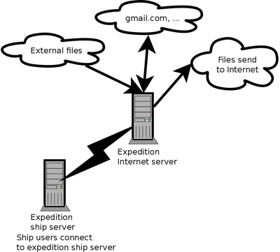

name: inverse
layout: true
class: center, middle, inverse
---
layout: false
template: inverse
class: title-slide
### Sistema de correu electrònic a Antarctic Circumnavigation Expedition 2016-2017


.right[Sudoers, Barcelona, 2019. Carles Pina]
---
layout: false
# Contingut
- Qui soc
- Qué és ACE?
- Sistema informàtic i telecomunicacions
- Sistema de email
---
layout: false
# Qui soc
- Nascut a Manresa
- El 2009 vaig marxar a Londres treballar per Mendeley
- C++ i Qt
- Administrar sistemes no és el meu dia a dia
- Ho faig una mica per hobby... amb mètodes poc actualitzats?
- Sempre m'ha agradat el programari lliure
- El 2016 ens vàrem agafar un any sabàtic
---
class: middle, center
# Qué és ACE?
---
background-image: url(images/ace_final_map_official.png)
background-size: contain
.footnote[Copyright: Swiss Polar Institute]
---
# L'expedició
- Molt especial: dona la volta l'Antàrtida
- Molta varietat científica: illes, oceanografia, atmosfèric, etc. (22 projectes científics)
- Primera expedició de l'Institut Polar Suïss (SPI)
- El vaixell és rús (i la tripulació, ordinadors...)
- Novembre 2016: el cap científic David Walton va contactar amb la Jen per si podia fer de Data Manager
- 3 etapes d'un mes

I vàrem tornar a Europa amb vaixell

I després vàrem tornar amb vaixell cap a Alemania
---
background-image: url(images/akademik_tryoshnikov_grytviken.jpg)
background-size: contain
---
# R/V Akademik Tryoshnikov

- Trencagel rús
- 133 metros d'eslora
- 23 metros de mànega
- Tripulació: 60 persones: cuiners, enginyers, tècnics. Sense informàtic
- Llogat per l'expedició: gairebé tots els projectes científics van portar els seus propi equipament
---
background-image: url(images/rocking.jpg)
background-size: contain
---
class: middle, center
# Els científics
---
background-image: url(images/ace_team.jpg)
background-size: contain

.footnote[Copyright Swiss Polar Institute]
---
background-image: url(images/south_georgia_ciencia.jpg)
background-size: contain
---
background-image: url(images/waves.jpg)
background-size: contain
---
background-image: url(images/releasing_radiosonde.jpg)
background-size: contain
---
# Què vàrem fer
- Gestionar les dades dels 22 projectes
 - Vàrem crear una interfície per la base de dades amb Django
 - Configurar 2 NAS
 - Treballar amb els científics per crear metadades, etc.
- Telecomunicacions
 - Sistema de correu
 - Baixar/enviar fitxers durant la nit
 - Xarxa al vaixell
- Connectar equipament científic per backups, monitoratge, etc.
---
background-image: url(images/for_fun/penguins_02.jpg)
background-size: contain
---
# El començament...
va arribar 2 dies abans de sortir...


I va incloure anar a la cafeteria a baixar 300 MB pels Synology...
---
background-image: url(images/intranet_homepage.png)
background-size: contain
---
background-image: url(images/event_report.png)
background-size: contain 
---
background-image: url(images/intranet_location.png)
background-size: contain 
---
background-image: url(images/for_fun/penguins_03.jpg)
background-size: contain
---
# Iridium
- La constel·lació consta de 66 satèl·lits
--

- El nom és Iridium perquè originalment tenia 77 satèl·lits: número atòmic d'Iridium 
--

- Tenen satèl·lits en òrbita sense utilitzar: els activen i els posen al pla si tenen problemes
--

- Hi ha cobertura al pol nord i sud. És molt lent i inestable
--

- Els satèl·lits están a unos 780 Km de la tierra (GPS a unos 20.000 Km)
--

- Es poden veure a la nit
--

- Fa pocs mesos han acabat de posar en òrbita els satèl·lits nova generació
---
background-image: url(images/iridium1.jpg)
background-size: contain
---
background-image: url(images/iridium2.jpg)
background-size: contain
---
background-image: url(images/slow_ping.jpg)
background-size: contain
---
# Veure vídeo
## iridium-apt-get-update.ogv
---
# VSAT
- No vàrem fer servir VSAT
- Quan ho vaig poder provar (hemisferi nord, pel contracte que el vaixell té): uns 10 Mbps estables!
- L'antena sempre apunta (amb motors) a un satèl·lit geoestacionari
- A uns 35.900 Km de la terra (geoestacionari)
---
background-image: url(images/iridium3.jpg)
background-size: contain
---
# Email primera etapa
- Vàrem recomenar fer servir Thunderbird i utilitzar una de les dues connexions amb cable
- Va anar força malament:
 - Windows té time-outs curts pel DNS
 - Thunderbird té problemes amb connexions inestables (y mala informació per l'usuari)
 - Vàrem haver de configurar varis Thunderbirds per diferents proveidors (universitats, empreses, etc.)
 - Mai sabiem si hi havia un error de la configuració (servidores IMAP, SSL, usuari/contrasenya) o error a la connexió
 - Vàrem configurar Thunderbird per baixar només emails nous, només si són més petits de 50 KB, etc.
 - M'exasperava veure gent esperant davant d'una pantalla per enviar un email. No era fiable y era muy estresante (i pobres portàtils...)
---
# Baixar dades científiques
- A la nit baixàvem dades científiques (90 minuts per uns 15 MB, amb desconnexions, molt variable)

--

```bash
until rsync -e "ssh -o ConnectTimeout=120 -o ServerAliveInterval=120" \
            -vtaz --progress --inplace --timeout=120 --bwlimit=10k
do
    date
done
```
---
background-image: url(images/for_fun/iceberg_01.jpg)
background-size: contain
---
background-image: url(images/for_fun/penguins_05.jpg)
background-size: contain
---
template: inverse
# Email etapa 2
---
# Sistema d'email
Quan vàrem arribar a Austràlia...:
- Vaig comprar un servidor VPS a Gandi
- Vaig configurar Postfix (SMTP) i Dovecot (IMAP)
- Vaig configurar un servidor al vaixell amb Roundcube (Webmail), fetchmail (client IMAP) i Postfix
- Amb Django vàrem fer un sistema per crear usuaris al servidor del vaixell i al d'internet
(res amb Docker, no l'havia fet servir abans)
---
background-image: url(images/roundcube.png)
background-size: contain
---
# Crear els usuaris
Tot amb pressa, comanda Django que treia a sortida i copiar-enganxar:
## Vaixell
```bash
useradd --create-home carles.pinaestany
echo carles.pinaestany:ahf5zesd83 | chpasswd
useradd --create-home jen.thomas
echo jen.thomas:3diasd3dkd | chpasswd
```
## VPS
```bash
useradd --shell /bin/false --create-home carles.pinaestany
echo carles.pinaestany:Aib3gah0oTh5ii1pai0t | chpasswd
echo carles.pinaestany | saslpasswd2 -u ace-expedition.net Aib3gah0oTh5ii1pai0t
#####
useradd --shell /bin/false --create-home jen.thomas
echo jen.thomas:Bae5hahgho1iephuu5qu | chpasswd
echo jen.thomas | saslpasswd2 -u ace-expedition.net Bae5hahgho1iephuu5qu
```
---
# Enviament d'emails
- Vaig limitar el màxim a 50 KB (a Roundcube i a Postfix) (després ho vàrem pujar a 200 KB)
--

- Vaig fer que el Postfix del vaixell només fes dues connexions cap al servidor d'internet
---
# Servidor d'internet


---
background-image: url(images/for_fun/clouds_01.jpg)
background-size: contain
---
class: middle, center
## Recepció d'emails
---
# Recepción d'emails (versió 1)
- Amb Django (usuaris estaven a la base de dades Django) vaig generar un .fetchmailrc que baixava tots els emails de tots els usuaris (fins a 50 KB)
- Resultat:
 - Si no hi havia emails fetchmail tardava unes 4 hores a comprovar que no hi havia emails (feia una connexió per cada usuari) (IMAP té moltes "anades i tornades")
 - Si la connexió fallava per un usuari: fetchmail "ignorava" aquest fins a la propera passada
 - Els emails podien tardar 8 hores a ser rebuts si fetchmail fallava per un usuari (i només si eren de la mida decididia)
- fetchmail és ideal:
 - time outs alts per defecto
 - bona opció -v (vaig anar aprenent el IMAP)
 - bons exit codes per automació més tard
---
# Recepció d'emails (versió 2)
- Vaig generar un .fetchmailrc de només els usuaris de la segona part del viatge (llavors tardava unes dues hores enlloc de 4)
---
# Recepción de emails (sistema 3, definitivo)
Vaig pensar que només volia fer que fetchmail recullís emails d'usuaris que tenien emails.

Vaig mirar com organitza Dovecot els emails a veure si podia saber quins usuaris tenien emails nous...
--


Dovecot deixa els emails nous a /home/$USERNAME/Maildir/new

I el nom del fitxer és el timestamp de mail rebut P. ex: 1498094976.24034_1.servidor64
---
## Quins usuaris tenen emails a baixar?
### Script al servidor d'Internet
Un script en Python mirava tots els /home/* y imprimia a la sortida estàndard:
```
/home/carles.pinaestany/Maildir/new/1498094976.24034_1.servidor64
/home/john.doe/Maildir/new/1375352537.24034_1.servidor64
```
Script: https://github.com/cpina/science-cruise-data-management/blob/master/ScienceCruiseDataManagement/utilities/messages_to_download.py
(podia haver estat un find + grep)

---
### Script al servidor del vaixell
```python
cmd = "ssh -o ConnectTimeout=120 -o ServerAliveInterval=120 root@{} \
./messages_to_download.py > '{}'".format(settings.IMAP_SERVER, output_file_path)
```
L'script (al vaixell) té la lògica per saber quins usuaris mirar el mail primer (els usuaris amb els mails més vells)
--


Llavors aquest script amb Python genera un "fetchmailrc" per a aquest usuari i executa:
```python
fetchmail --timeout 120 --fetchmailrc {} --pidfile {}".format(file_name, pidfile)
```
(amb un while fins que funciona)

Script: https://github.com/cpina/science-cruise-data-management/blob/master/ScienceCruiseDataManagement/main/management/commands/downloademailsbyage.py

(també imprimia estadístiques de propers usuaris, mail més vell, etc.)
---
# Emails massa grans per baixar
- Durant uns dies la gent no sabia si havien rebut emails massa grans
- Vaig fer un notificador d'emails grans. Python i imaplib (imaplib per connectar-se i veure quins emails són massa grans)

Script: https://github.com/cpina/science-cruise-data-management/blob/master/ScienceCruiseDataManagement/main/management/commands/warningoversizeemail.py
---
# Emails massa grans per baixar
Per evitar problemes amb desconnexions...:
```python
import socket

socket.setdefaulttimeout(30)

while True:
    try:
        print("Checking: {} {}/{}".format(email_account.email_address, index+1, len(emails_active_leg)))
        self.check_user(email_account.email_address)
        break
    except ConnectionResetError:
        print("Connection Reset Error for user: {}. Trying again".format(email_account))
    except socket.timeout:
        print("Connection timeout Error for user: {}. Trying again".format(email_account))
    except OSError:
        print("Probably 'Network is unreachable' error for user {}. Trying again".format(email_account))
```
---
# Emails massa grans
warningoversizeemail.py feia:
- Enviar un email (local, al vaixell) per notificar al destinatari que tenia un mail massa gran
 - Amb la mida, Subject, remitent i email UID
- Guardava l'UID i altre informació a una taula (per avisar-lo només una vegada)

El mail de notificació deia "si aquest email és molt important avisa a l'equip de data management".
---
# Com baixar els emails grans?
- Una manera seria fer servir fetchmail sense el limit d'email màxim. Però la connexió era MOLT inestable, baixar alguna cosa de 500 KB (o MB) seguit era gairebé impossible
--

## ¡rsync!

---
background-image: url(images/for_fun/penguins_04.jpg)
background-size: contain
---
# downloademail.py
- ./downloademail.py $USERNAME $UID
--

- Baixa el fitxer remot $USERNAME/Maildir/dovecot-uidlist . Conté:
--


```bash
carles@servidor64:~/Maildir$ cat dovecot-uidlist 
3 V1336238204 N87624 Gd445dd1a9d8c8e51350f0000d09efc50
87623 W1257 S1224 :1499969465.29226_1.servidor64
87624 :1499969500.29282_1.servidor64
```
--

- Mira quin és el nom de fitxer per el $UID notificat
--

- Baixa (rsync) el fichero que conté el mail: p. ej. $USERNAME/Maildir/new/1499969500.29282_1.servidor64. Amb els reintents...
--

- Guarda el fichero baixat al servidor del vaixell a $USERNAME/Maildir/.DownloadedEmails
--

- Actualitza (si és necessari) el fichero local $USERNAME/Maildir/subscriptions
---
# ¿Com enviar emails (fitxers) grans?
- Els usuaris venien i ens portaven fitxers grans a una memòria USB, a una carpeta compartida, etc.
- A vegades ho enviavem amb un script (until rsync - anar provant) al servidor d'Internet a /var/www/uploaded/misc/nombre_fichero.zip
- Altres vegades ho posàvem a una cua durant la nit
---
# Utilitzar dos Iridiums per dades des del mateix servidor
- Al servidor d'internet vaig (via iptables) vaig redirigir el port 2222 al port 22
- Servidor al vaixell: tenía un default gw (Iridium1). Però els paquets que anàven al port 2222 els marcava (no recordo bé com!) per anar via un altre gateway: Iridium 2
- Tenía dos rsync_queue.py: uno que usaba el puerto 22 y el otro el puerto 2222
---
background-image: url(images/for_fun/penguins_01.jpg)
background-size: contain
---
# Propera expedició
- A Groenlàndia aquest agost i setembre
- Amb el mateix vaixell
- Mateix equip de dades :-)
- Ja ens estem posant apunt
- Un Iridium com el vell i un "Next" (una mica més ràpid)
---
# Email a la propera expedició
- Docker al vaixell i al servidor. Imatges des de Debian i posar Postfix o alguna cosa ja més feta?

Voldria no accedir a sistema de fitxers per utilitzar Dovecot (més doveadm?)

- Com saber quins mails cal baixar? (ara és l'script per mirar /home/$USERNAME/Maildir/new)
- Com baixar el mail de Dovecot? (ara és rsync mirant /home/$USERNAME/Maildir/dovecot-uidlist per trobar el fitxer)
- Com injectar el mail en local? LMTP pot fer-ho? val la pena?
---
template: inverse
# Moltes gràcies!

# Preguntes?
---
layout: false
background-image: url(images/logo_ACE.png)
background-size: contain
---
class: inverse
## Contacte
- Carles Pina i Estany ([carles@pina.cat](carles@pina.cat))

## Llicència


[Reconeixement-CompartirIgual 4.0 Internacional (CC BY-SA 4.0)](https://creativecommons.org/licenses/by-sa/4.0/deed.ca).

## Diapositives
Les diapositives han estat escrites amb Markdown i renderitzades amb remarkjs (https://remarkjs.com)

Git: https://github.com/cpina/ace-it-presentation

Visualitzar: https://cpina.github.io/ace-it-presentation/
