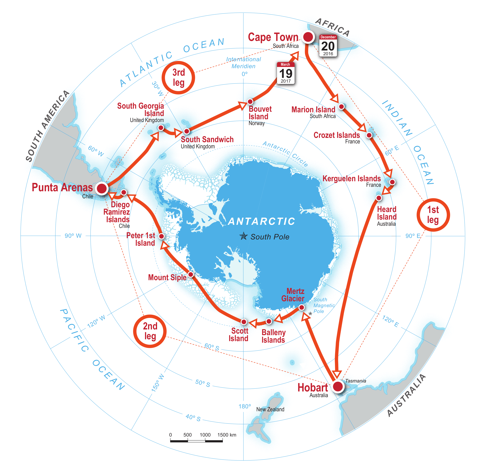

name: inverse
layout: true
class: center, middle, inverse
---
layout: false
template: inverse
class: title-slide
### Volta a l'Antàrtida en un vaixell científic: què hem vist, fet i viscut

.right[ADENC, 2018. Jen Thomas (jenny_t152@yahoo.co.uk) i Carles Pina (carles@pina.cat)]
---
layout: false
# Qui som
## Jen
--

## Carles
---
# Què feiem al vaixell
- Gestió de dades
 - Programar eines per ajudar als científics a copiar, organitzar les dades
 - Assegurar que les dades estiguin disponibles després de l'expedició per tothom
- Configuració d'equips informàtics:
 - Xarxa interna al vaixell
 - Comunicacions externes
- Configuració d'equips científics (part dades, connexió a la xarxa, etc.)
---
background-image: url(images/computer_room_big.jpg)
background-size: contain
---
# Què és SPI?
- Swiss Polar Institute  (Institut Polar Suís)
- Fundat el 2016
- Investigació dels pols i àrees extrems

Més informació:
- https://polar.epfl.ch/page-134197-en.html
- https://polar.epfl.ch
---
class: middle, center
# Què és ACE?
Antarctic Circumnavigation Expedition 

Expedició Circumnavagació a l'Antàrtida

http://spi-ace-expedition.ch/
---
background-image: url(images/ace_final_map_official.png)
background-size: contain
.footnote[Swiss Polar Institute]
---
class: middle, center
# R/V Akademik Tryoshnikov

Vaixell Rús (i cultura, menjar, etc.)
---
background-image: url(images/akademik_tryoshnikov_grytviken.jpg)
background-size: contain
---
# Per què ACE és diferent?
- Normalment les expedicions científiques van només a una zona de l'Antàrtida
--

- L'única altre expedició similar ha estat Discovery II al 1950
--

- ACE ha recullit mostres i estudiat disciplines marines, terrestres i de l'atmosfera a la vegada
--

- És la primera expedició de l'SPI (Institut Polar Suís)
--

- Es va posar apunt amb temps record (van contactar amb nosaltres només 6 setmanes abans de la sortida)
---
# Sortint de port...
- Un mes: de Sudàfrica a Austràlia
- Primer cop dormint a un vaixell al mar
- Preparar: lligar els ordinadors?
- Gairebé sense Internet
- Conèixer el vaixell: cabina, oficina (sense finestres), gent, xarxa, aparells
- Tempestes
- Sense botigues per comprar "el típic cable que falta" (o que s'espatlla). Teniem dos de tot
---
background-image: url(images/propeller_blade.jpg)
background-size: contain
---
background-image: url(images/cabin.jpg)
background-size: contain
---
class: middle, center
# Cinc dies més tard...
---
**ETAPA 1** Sud-áfrica a Australia

.footnote[Swiss Polar Institute]
---
background-image: url(images/S689A0644.JPG)
background-size: contain

.footnote[**Ile des Cochons, Crozet**; Peter Ryan]
---
background-image: url(images/S689A0696.JPG)
background-size: contain

.footnote[**Ile des Cochons, Crozet**; Peter Ryan]
---
background-image: url(images/S689A0724.JPG)
background-size: contain

.footnote[**Ile des Cochons, Crozet**; Peter Ryan]
---
background-image: url(images/Sking_penguin_with_chick.JPG)
background-size: contain
---
# Dia a dia
- Esmorzar, dinar, berenar i sopar amb els científics
- Aprendre aparells: CTD, Ferrybox, comptador de flocs de neu, etc. (properes diapositives)
- Ciencia 24 hores per a aprovechar
- Treballar de despertar-se fins anar a dormir (amb pauses), sense caps de setmana
---
background-image: url(images/ctd_lab.jpg)
background-size: contain
---
background-image: url(images/ctd_water.jpg)
background-size: contain
---
background-image: url(images/ctd_cup.jpg)
background-size: contain
---
background-image: url(images/microcat_rotated.jpg)
background-size: contain
---
background-image: url(images/ferrybox-pipe.jpg)
background-size: contain
---
# El cap científic
- David Walton va ser el cap científic

- Qui prioritza durant l'expedició: visitar illes? Fer estacions? Desplegar equips?

- Diferents membres necessiten fer diferentes coses: teniem equips marítims i terrestres
---
background-image: url(images/1-scientists-plan-their-upcoming-visit-of-south-georgia-sharif-mirshak.jpg)
background-size: contain

.footnote[Sharif Mirshak]
---
background-image: url(images/ace_team.jpg)
background-size: contain

.footnote[22 equips. Swiss Polar Institute]
???
22 equips
---
**ETAPA 2** Australia a Chile

.footnote[Swiss Polar Institute]
---
background-image: url(images/ropos-submersible-being-deployed-in-front-of-the-mertz-cian-hogg.jpg)
background-size: contain

.footnote[**ROPOS**

Ian Hogg]
---
background-image: url(images/animaux-benthiques.jpg)
background-size: contain
---
background-image: url(images/scott-island-cf-bernard.jpg)
background-size: contain

.footnote[**Illa de Scott**&nbsp;&nbsp;&nbsp;&nbsp;François Bernard]
---
**ETAPA 3** Chile a Sud-áfrica

.footnote[Swiss Polar Institute]
---
background-image: url(images/south_georgia_ciencia.jpg)
background-size: contain
---
# Alguns numeros

- km travelled
- mostres de coses
- no gent de no paisos
- no illes visitades
---
# Material

- http://spi-ace-expedition.ch/

- Llibre d'en Rafel Simó (cientfíc oceanògraf) sobre l'expedició: https://www.nuvol.com/ebooks/mar-gel-i-cel-diari-antartic/

- Blog Rafel Simó: http://www.recercaenaccio.cat/basic/els-precedents-de-lexpedicio-una-volta-a-lantartida-no-fumis/

- Vídeos:
 - Part 1: https://www.youtube.com/watch?v=87TvkL0meGU
 - Part 2: https://www.youtube.com/watch?v=zUHk-jAe2Gw
 - Part 3: https://www.youtube.com/watch?v=pt_Euo08O9I
---
template: inverse
# Preguntes?
---
class: inverse
## Contactes
- Jen Thomas ([jenny_t152@yahoo.co.uk](jenny_t152@yahoo.co.uk))
- Carles Pina i Estany ([carles@pina.cat](carles@pina.cat))

## Llicència

Aquesta obra està subjecta a una llicència de [Reconeixement 4.0 Internacional de Creative Commons](https://creativecommons.org/licenses/by-sa/4.0/deed.ca).
